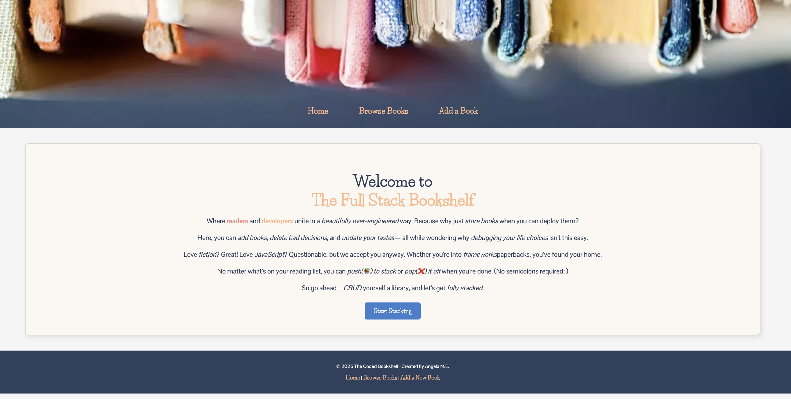

# 📚 The Full Stack Bookshelf

Welcome to **The Full Stack Bookshelf**—a simple and fun way to keep track of books! Whether you're a book lover, a developer, or a little bit of both, this app helps you **add, browse, update, and remove** books with ease.



## ✨ Features
- 📝 **Add** books to the collection.
- 🔍 **View** a list of all books.
- ✏️ **Edit** book details.
- ❌ **Delete** books when needed.
- ✅ **Mark books as read** or unread.
- 🎨 **Clean and playful design** with warm colors.

## 🛠️ Built With
- **Node.js** and **Express.js** for the back-end.
- **MongoDB** and **Mongoose** for database management.
- **EJS (Embedded JavaScript)** for templates.
- **CSS** for styling.

---

## 🚀 Getting Started

### 1️⃣ Clone the Project
```sh
git clone https://github.com/your-username/full-stack-bookshelf.git
cd full-stack-bookshelf

2️⃣ Install Dependencies

npm install

3️⃣ Set Up a Database

You’ll need MongoDB running locally or a cloud-based MongoDB Atlas database.

Create a .env file and add:

MONGO_URI=your-mongodb-connection-string
PORT=3000

4️⃣ Run the App

npm start

Once running, visit http://localhost:3000 in your browser.

⸻

📌 Routes Overview

Route	Method	Description
/	GET	Landing Page
/books	GET	View all books
/books/new	GET	Add a new book form
/books	POST	Submit a new book
/books/:id	GET	View a specific book
/books/:id/edit	GET	Edit an existing book
/books/:id	PUT	Update book details
/books/:id	DELETE	Remove a book


⸻

🏗 Project Structure

full-stack-bookshelf/
│── public/                  # Static assets (CSS, images)
│── views/                   # EJS templates
│   ├── books/               # Book-related views
│   │   ├── index.ejs        # Book list page
│   │   ├── show.ejs         # Single book page
│   │   ├── new.ejs          # Add book form
│   │   ├── edit.ejs         # Edit book form
│   ├── partials/            # Navbar, footer, head
│── routes/                  # Express routes
│── models/                  # Mongoose schema
│── app.js                   # Main application file
│── package.json             # Dependencies & scripts
│── README.md                # Project info


⸻

🎨 Design & Styling

The app has a simple, cute, and warm design:
	•	🍑 Soft peach & pink color accents.
	•	📦 Books are displayed as cards.
	•	✨ Smooth hover effects.
	•	🎀 A styled navbar & footer for consistency.

⸻

💡 Ideas for Future Features
	•	🔍 Search functionality.
	•	⭐ User ratings and reviews.
	•	📚 User-specific book collections.
	•	📌 Categories and filters.

⸻

🤝 Contributing

If you have ideas or improvements, feel free to contribute! Fork the repo, make your changes, and submit a pull request.

⸻

📜 License

This project is open-source and free to use. Modify it, improve it, and make it your own!

⸻

Thanks for checking out The Full Stack Bookshelf! 🎉 Happy coding & happy reading! 📖✨
